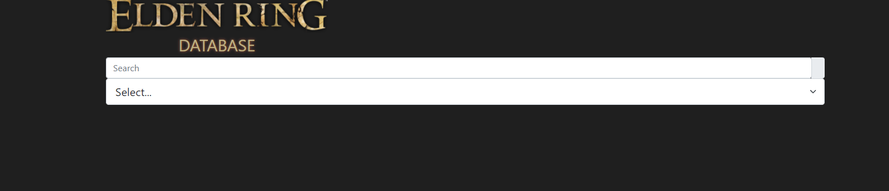
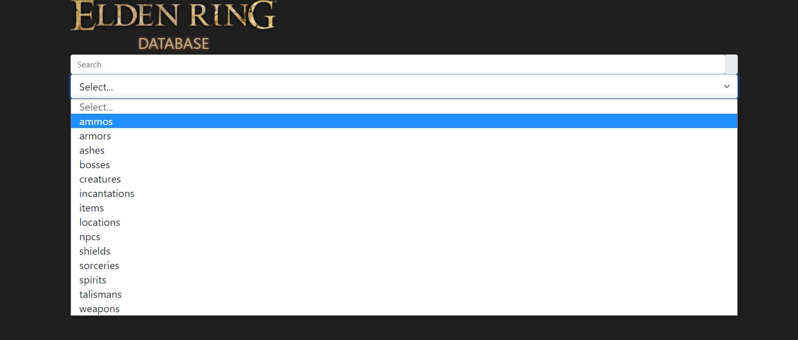
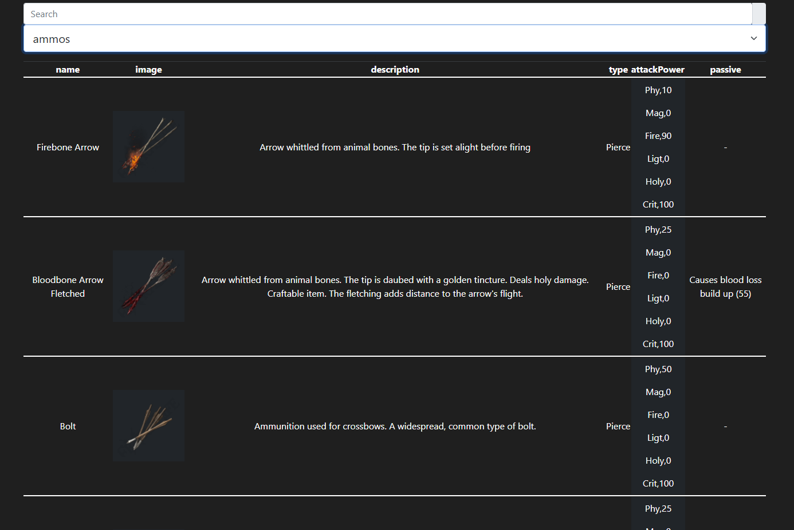
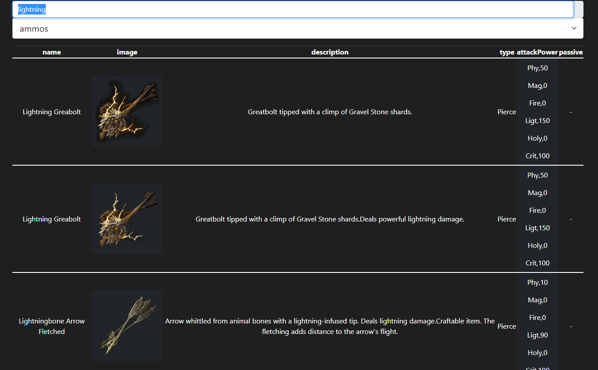

# Elden Ring DB
Elden Ring DB is a simple Database of information for the video game Elden Ring

# About the Creation of this Project
This is a school project for the first phase at FlatIron School. This project utilizes vanilla JS, HTML, and basic CSS. The project dynamically creates an HTML table from data fetched from a public Elden Ring API: https://eldenring.fanapis.com/ (thank you!)

# Using the Database

Upon opening the HTML document, you will be brought to the default index page consisting of the logo, search bar, and Select menu

Click the "Select..." menu and choose the desired category of information for Elden Ring.

The chosen option will automatically generate a table of data. For example, I can get a list of all the arrows from the "ammos" menu item.

There is a lot of data to take in for some categories. Utilize the search bar on the specified category to get the desired name. Here we are searching for all arrows with lightning damage:

The table will keep updating on input for whatever you type, no need to press enter for search. A new table will generate for every change in option on the dropdown menu. 